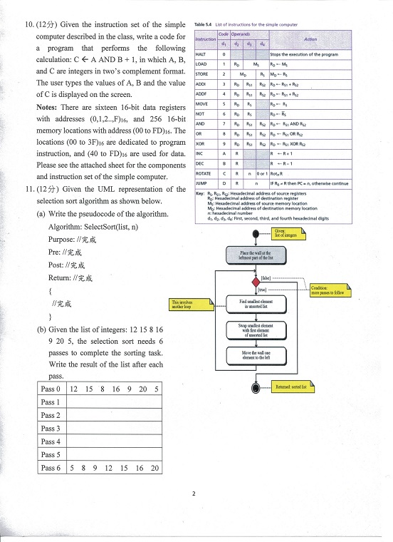
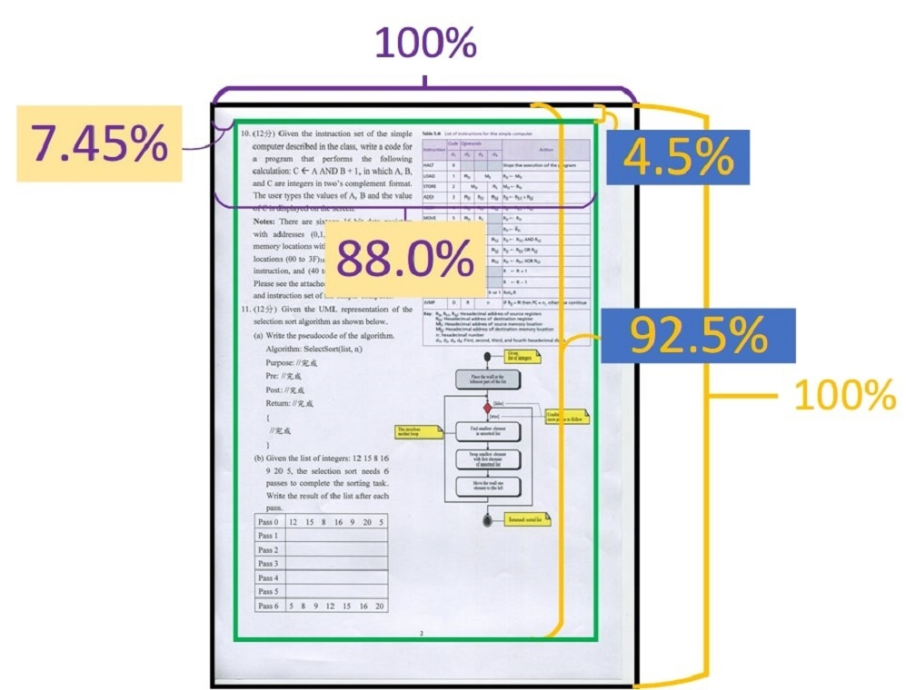

# scanned_file_kirei
將文件掃描出電子檔的白色背景變得更白，這樣從電子檔印出來的白色背景就不會感覺灰灰的了。

## 使用結果


## 需要決定一些超參數
```python
FILE_PATH = "./file.jpg"
RATIO = 1  # 縮放大小, 1=原圖大小
LB_BOUND = [60, 210]  # 根據算出來的直方圖分割下界、上界
MEDIAN_KSIZE = 3  # 中值濾波器 kernel size
W_INNER = [0.0745, 0.880]  # 邊界強制留白處理時的 "不處理區間"
H_INNER = [0.0450, 0.925]  # 邊界強制留白處理時的 "不處理區間"
```

### Step  1 計算原圖的灰階直方圖
* 圖片很大張的話log-scale會有幫助


### Step 2 計算RGB的直方圖
* 這邊會需要看直方圖來決定將**上下界(右方的圖)**定在哪邊
```python
LB_BOUND = [60, 210]
```
* 在外側的點會分別設定為 **黑(左界)** 與 **白(右界)**


### Step 3 於是圖片變成這樣
* 此時有可能會有躁點(黑點會位於文字區塊內，要放大才會感受到)



### Step 4 過個 median filter


### Step 5 處理麻煩的邊際界
* 大部分掃描機掃出來都會有黑邊，所以設定邊緣區域來強制轉白
* 區域邏輯如下
```python
W_INNER = [0.0745, 0.880]
H_INNER = [0.0450, 0.925] 
```
* **綠色框外** 到 **黑色框內**，就是要強制轉白的區域
* 左上角為 (0%, 0%)
* 這種%數取法看似很繞但在程式上很好寫。
* 紫色對應=W_INNER, 黃色對應=H_INNER 


### Step 6 成果


